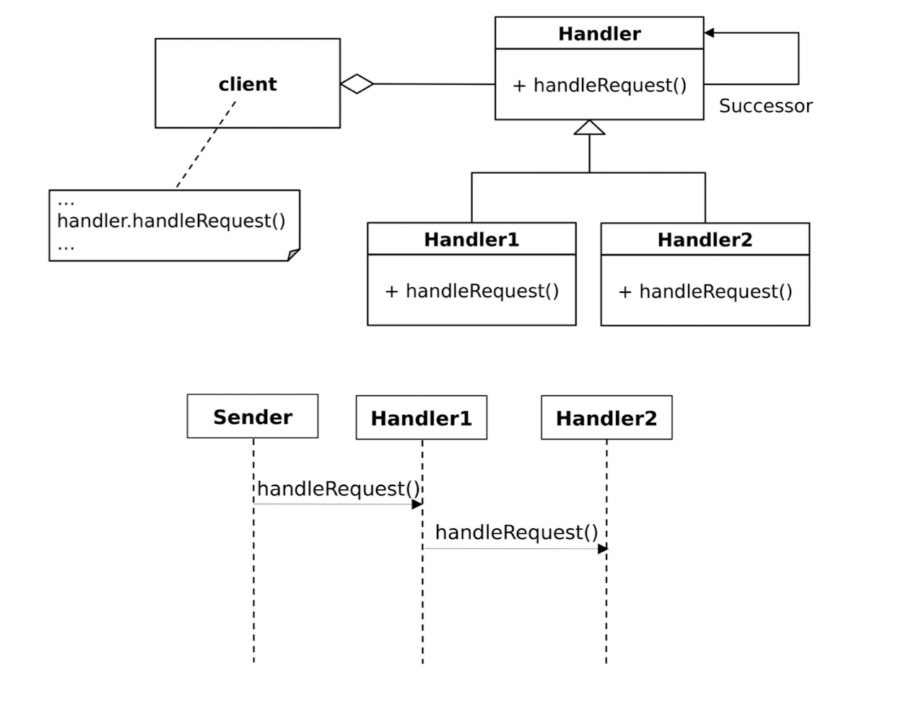

Chain Of Responsibility
---------------------------

The Chain of Responsibility (CoR) pattern is a behavioral design pattern that allows an object to pass a 
request along a chain of potential handlers until the request is handled. 
This pattern decouples the sender of the request from its receiver by giving multiple objects the 
opportunity to handle the request.

Problem: The Chain of Responsibility design pattern addresses the issue of  coupling the sender of a request 
to its receiver, where there may be multiple  potential receivers for the request, but the sender should not 
know which  receiver will handle the request. This leads to a rigid and inflexible design,  
making it difficult to add or remove new handlers without modifying the sender's  code. 
The problem arises when a request must be processed by multiple  objects, but the specific handler is not 
known at compile-time.

Solution: The Chain of Responsibility design pattern promotes a decoupled and  flexible solution to the 
above problem. It allows multiple objects to have the  chance to handle a request without the sender 
needing to know the exact  receiver.

Key Concepts

* Handler Interface: Defines an interface for handling requests. It typically includes a method to process the request and another to set the next handler in the chain.
* Concrete Handler: Implements the handler interface and provides specific logic to handle the request. If the handler is unable to process the request, it passes it to the next handler in the chain.
* Client: The client creates and configures the chain of handlers and passes the request to the first handler.

When to Use

* When multiple objects can handle a request, but the specific handler isn't determined until runtime.
* When the handler is not known by the client.
* When you want to decouple request processing logic from the request sender.

Example Use Cases

* Logging systems where different loggers handle different levels of logging.
* Event handling systems where different handlers process specific types of events.
* Request validation systems where different validators check different aspects of a request.

