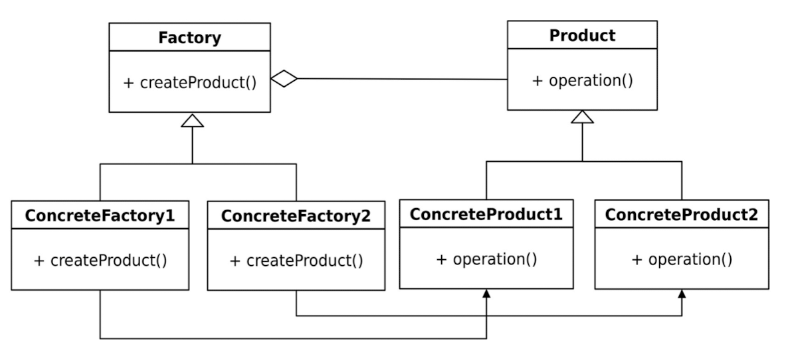

Factory Method Pattern
------------------------

The Factory Method pattern is a Creational design pattern that provides an  interface for creating objects 
in a super-class but allows its subclasses to alter  the type of objects that will be created. 
It abstracts the process of object creation  and defers it to the subclasses. This pattern is useful when 
you want to decouple  the creation of objects from the code that uses them, or when you want to  
provide a common interface for creating related objects that can be customised  in different ways.

Problem: Consider a scenario where you have a class that needs to create  objects, but the exact type of 
objects to be created is not known until runtime.  Directly instantiating objects in this class would 
tightly couple it to the concrete  classes, making it difficult to extend and maintain the code. 
Additionally, if you  add new types of objects in the future, you would have to modify the existing  class, 
violating the Open-Closed Principle (part of the SOLID principles).

Solution: The Factory Method pattern suggests defining an interface or an  abstract class to declare the 
method (the factory method) responsible for  creating objects. The super-class will use this factory method 
to create objects,  but it won't be concerned with the actual instantiation process. Instead,  
subclasses will provide their implementations for the factory method, allowing  them to decide the specific 
type of objects to create.

Here are the key elements of the Factory Method pattern:  
1. Creator: The Creator is an abstract class or interface that defines a  factory method for creating objects. 
This method returns an instance of a  Product, but the specific class of Product to create is left to the 
concrete  Creator subclasses.  
2. Concrete Creator: A Concrete Creator is a subclass of Creator that  implements the factory method to 
create a specific type of Product.  
3. Product: The Product is the object that the factory method creates. 
It is  usually an abstract class or interface that defines the interface for the  objects that the factory 
method creates.  
4. Concrete Product: A Concrete Product is a subclass of Product that  implements the interface defined by 
Product.

