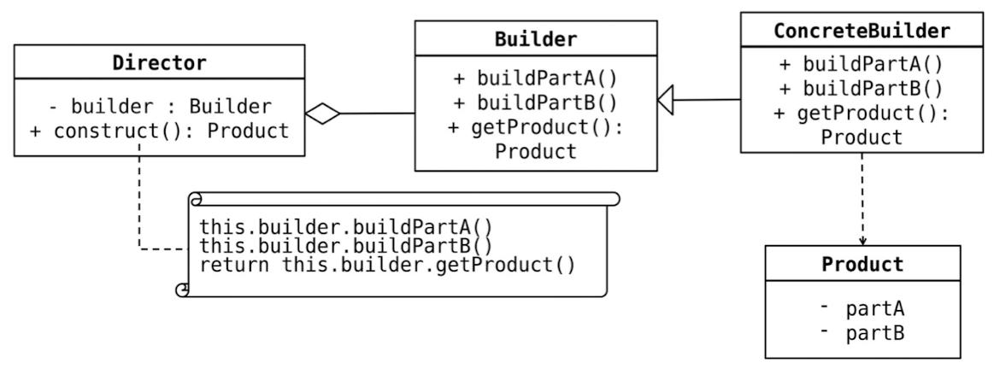

Builder Design Pattern
--------------------------

The Builder design pattern is a Creational design pattern that is used to  construct complex objects step 
by step. It separates the construction of a  complex object from its representation, allowing the same 
construction process  to create different representations. This pattern is particularly useful when the  
construction process of an object is complex, and the object can have multiple  valid configurations.

Problem: In software development, sometimes you need to create objects that  have multiple attributes or 
configuration options. Instantiating such complex  objects using traditional constructors with numerous 
parameters can be  cumbersome, error-prone, and hard to maintain, especially if there are many  possible 
combinations of properties. Also, having multiple constructors with  different combinations of parameters 
can lead to code duplication.

Solution: The Builder design pattern addresses the above problem by defining  a separate class (the Builder) 
responsible for creating the complex object. The  Builder class provides methods for setting individual 
attributes or configurations  of the object. Once all the necessary attributes are set, the Builder produces 
the  final object.

The main components of the Builder Pattern are:  
1. Builder: an abstract interface for creating parts of a complex object.  
2. ConcreteBuilder: a concrete implementation of the Builder interface that  builds and assembles parts of the complex object.  
3. Director: responsible for managing the construction process using the  Builder interface.  
4. Product: the final object that is created by the Builder.

