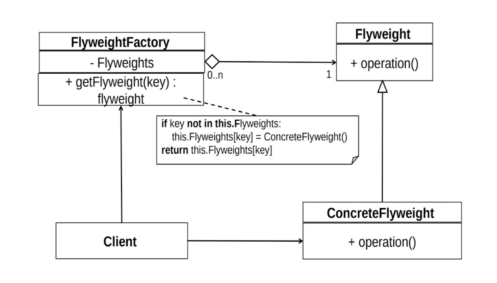

Flyweight Pattern
-------------------

The Flyweight design pattern is a Structural pattern used to optimise memory  usage by sharing common data 
among multiple objects. It is particularly useful  when dealing with a large number of similar objects that 
have some intrinsic  (invariant) state and some extrinsic (context-dependent) state. By sharing the  
intrinsic state, the pattern reduces the memory footprint and improves  performance.

Problem: The problem that the Flyweight pattern aims to address is the  excessive memory usage and 
inefficiency caused by creating large numbers of  similar objects, each with its own unique data. 
This is especially common in  situations where objects have some shared characteristics and a significant  
portion of their state can be reused across multiple instances.

Solution: The solution involves creating a FlyweightFactory that manages a  pool of shared flyweight objects. 
These objects are shared by multiple clients,  and each object is designed to be immutable and stateless. 
This means that the  object's properties cannot be changed once it has been created, which makes it  safe for 
sharing. When a client requests a flyweight object, the factory class  checks if an instance of that object 
already exists in the pool. If so, it returns the  existing object. If not, it creates a new object, adds it 
to the pool, and returns it to  the client.

By using the Flyweight pattern, an application can reduce memory usage and  improve performance, especially 
in situations where a large number of objects  are created and used repeatedly. However, it's important to 
note that the pattern  may not be suitable for all situations, and careful consideration should be given  
to the specific requirements of the application before implementing it.

The Flyweight pattern proposes dividing an object's state into two parts:  
1. Intrinsic State: Represents the data that is shared among multiple  objects and remains constant throughout 
their lifetime.  
2. Extrinsic State: Represents the data that is unique to each individual  object and can vary depending on 
the context.

